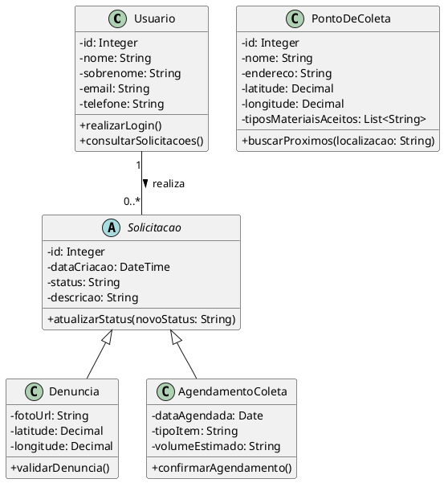
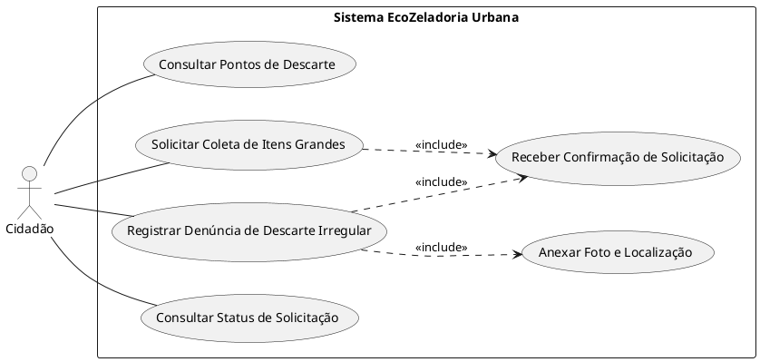

# Objetivos do Sistema

## Objetivo Geral
Desenvolver uma plataforma digital que centralize informações sobre descarte correto e facilite a comunicação direta entre o cidadão e os serviços de coleta municipal

## Objetivos Específicos
- Mapear pontos de coleta seletiva
- Agendar coletas de itens volumosos e de difícil transporte
- Viabilizar a denúncia de descarte irregular com localização e fotos
- Informar o cidadão sobre as regras, normas e calendários de coleta

# Público Alvo
O sistema é destinado a cidadãos residentes em áreas urbanas que buscam descartar materiais de forma legal, além de líderes comunitários interessados na preservação do bairro e da cidade

# Requisitos Funcionais
- **RF01:** O sistema deve permitir que o usuário visualize um mapa que mostra os pontos de descarte
- **RF02:** O sistema deve permitir o cadastro de denúncias de descarte irregular.
- **RF03:** As fotos enviadas devem ser compactadas pelo servidor para um tamanho máximo de 2MB por arquivo. O sistema deve aceitar uploads de até 10MB e aplicar compressão automática (qualidade JPEG de 80%) antes de armazenar, sem rejeitar a foto do usuário por tamanho.
- **RF04:** O sistema deve capturar ou permitir inserir a localização (GPS) do incidente através do dispositivo do usuário.
- **RF05:** O sistema só deve permitir denúncias e solicitações em que a localização inserida esteja dentro da área coberta pelo serviço municipal.
- **RF06:** O sistema deve permitir a solicitação de coleta de móveis, eletrodomésticos e outros similares.
- **RF07:** O sistema deve exibir uma lista de materiais aceitos em cada ponto de coleta.
- **RF08:** O sistema deve enviar uma confirmação de recebimento após cada solicitação.
- **RF09:** O sistema deve permitir que o usuário consulte o status de suas solicitações anteriores.
- **RF10:** O sistema deve fornecer uma seção de "Dúvidas Frequentes" sobre tipos de resíduos.
- **RF11:** O sistema deve permitir autenticação via Magic Link enviado por email

# Requisitos Não Funcionais
- **RNF01:** O sistema deve ser responsivo (funcionar em dispositivos móveis e desktop).
- **RNF02:** O tempo de carregamento das telas de mapa não deve ultrapassar 3 segundos.
- **RNF03:** As fotos enviadas devem ser compactadas para não exceder 2MB por arquivo, garantindo economia de dados.
- **RNF04:** O Magic Link deve expirar em 15 minutos e ser único por email.
- **RNF05:** Emails de autenticação devem ser entregues em até 30 segundos.

# Regras de Negócio
- **RN01:** Uma denúncia de descarte irregular só pode ser finalizada se houver pelo menos uma foto anexada e a localização.
- **RN02:** O agendamento de coleta de grande porte exige um intervalo mínimo de 48 horas de antecedência.
- **RN03:** O usuário deve estar logado no sistema para realizar solicitações ou denúncias.
- **RN05:** O Magic Link só é válido por 15 minutos após envio e invalida logins anteriores no mesmo email.

# Modelagem

## Diagrama de Classes (em PlantUML):

## Caso de Uso:

